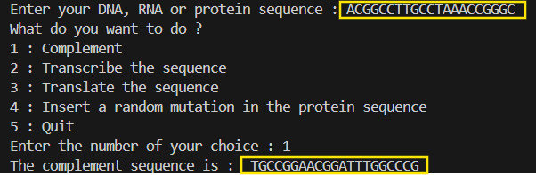
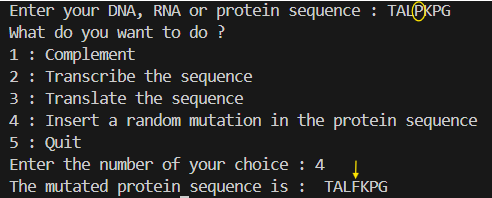

# SequenceTools-Python

A menu-based program for **DNA / RNA / Protein** operations written in **Python** (no external libraries).  
Originally built for my **Bioinformatics coursework** and later **refined and polished** for clarity.

> Purpose: show how to automate basic sequence tasks with clean, readable code that anyone can run from a terminal.

---

##  Core principles
The script reads your sequence as text.
- **Complements** a DNA sequence: A ↔ T, C ↔ G  
- **Transcribes** DNA → RNA: T → U
- **Translates** RNA → Protein: 3 RNA letters (a codon) → 1 amino acid  
- **Inserts a random substitution** in a protein (single amino-acid mutation)

---

##  How to run

**Requirements:** Python 3.8+

```bash
python seq_cli_purepython.py
```
---
##  Concrete examples (input → output)

### 1) Complement (DNA → cDNA)

The user enters a DNA sequence, chooses 1: Complement.

Input (DNA): ACGGCCTTGCCTAAACCGGGC

Output (Complement): TGCCGGAACGGATTTGGCCCG



### 2) Transcribe (DNA → RNA)

Choose 2: Transcribe.

Input (DNA): ACGGCCTTGCCTAAACCGGGC

Output (RNA): ACGGCCUUGCCUAAACCGGGC


### 3) Translate (RNA → Protein)

Choose 3: Translate.

Input (RNA): ACGGCCUUGCCUAAACCGGGC

Output (Protein): TALPKPG


### 4) Mutate (Protein → Protein with 1 substitution)

Choose 4: Insert a random mutation.

Input (Protein): TALPKPG

Output (Mutated Protein): e.g., TALFKPG (position & new AA are random; output varies)




